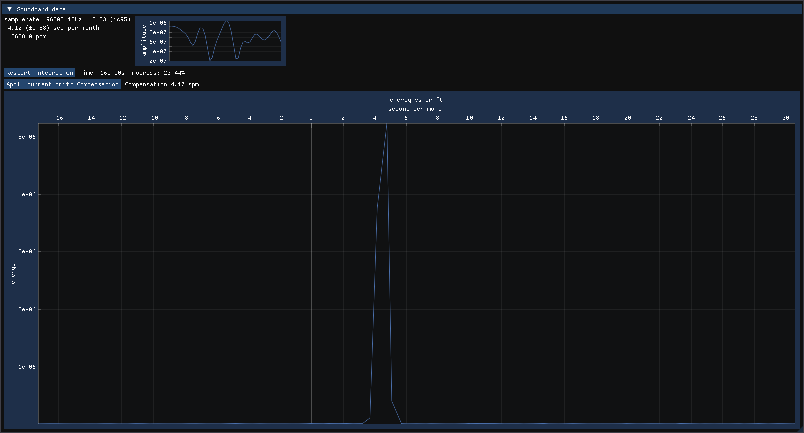

# qtg

This software is a time grapher for quartz watches. It uses a standard soundcard and microphone to listen to the quartz oscillation and compute its monthly drift.

what you need :
* A soundcard with a sample rate of 96000Hz minimum
* A microphone reasonably good with ultrasound (any electret should do)
* A very good system clock (the result cannot be better than your computer's clock), NTP is highly recommanded




/!\ Most modern quartz watch uses an inhibition system, their quartz run too fast on purpose and a factory configured circuit drop the proper amount of cycle to compensate. This software is better suitted for old-school adjustable quartz watches.
I suspect this software might work for other "weird" watches : tuning fork, Seiko's spring drive (by listening to its train gear if the quartz dont work), weird frequency quartz watches (as long as it's under the soundcard's nyquist frequency).

## How does it work

As one might guess, the sound produced by a watch's quartz is very faint, you cannot detect it easily. This program use a bit of DSP magic to remove the noise and detect the quartz's signal.
This signal's frequency is measured using the soundcard's clock, which is not perfect either. This program implement a soundcard frequency monitoring using the system's clock.
In summary :
1. Compare the watch's internal clock to the soundcard's clock
2. Compare the soundcard's clock to the systems clock
3. Compensate for the soundcard's clock drift.

The system's clock being very good on the long run we can use it to evaluate the drift of the soundcard's one, and then the first.

Concretely, the DSP pipeline is as follow :
watch -> microphone/soundcard -> bandpass around 32768Hz -> mixing by oscillator at 32768Hz (in the soundcard's time) -> low pass -> downsampling by a factor 32000 or such -> compute which frequency around 0hz has the most energy -> apply soundcard compensation to find the actual "physical" frequency

regarding the soundcard :
timestamp each new buffer and compute it's actual frequency using the system's clock using linear regression. There is a rolling buffer to only consider the more recent data.


## How good it is ?
I dont know… it mostly depends on the soundcard's clock stability.
It should be better than ±1sec/month with standard hardware and good condition (stable temperature and low load).
You can check the state of synchronisation with ntp. Here on my computer with about 3 hours of uptime. 0.100ppm of skew is about 0.25sec/month bound on error.

```
% chronyc tracking
...
Frequency       : 8.272 ppm fast
Residual freq   : -0.003 ppm
Skew            : 0.100 ppm
...
```

## compilation

You should have this installed
```sh
apt install libxinerama-dev \
              libxcursor-dev \
              libxrandr-dev \
              libxi-dev \
              libx11-dev \
              libglu1-mesa-dev \
              libxext-dev \
              pkg-config \
              autoconf \
              libtool \
              xorg-dev
```

I would advice to install most dependancy using `vcpkg`, it could be something like this :

```sh
git clone https://github.com/simonArchipoff/qtg.git
git clone https://github.com/microsoft/vcpkg.git
cd vcpkg
./bootstrap-vcpkg.sh
cd ../qtg
../vcpkg/vcpkg install
cmake -B build -S . -DCMAKE_TOOLCHAIN_FILE=../vcpkg/scripts/buildsystems/vcpkg.cmake
cmake --build build --config Release
./build/qtg -l
```

## usage:
`qtg` start the program with the default soundcard and settings
`qtg -l` give the list of the sound interfaces available on your system and their ID

`qtg -d ID` start the program with the soundcard indexed by ID.

`qtg --help` for other options, including internal parameters.

## Todo:

* Better (nicer) UI
  - integrate the system's clock uncertainty in the interface
* Optimization of DSP (currently a lot of spurious computation is done)
  - switch to windowed correlation instead of fft
  - add phase drift to the computation for more precise result
* tweak it be able to use the envelope instead of bare signal, then it will work with mecanical watches.
* fix bug : I find the DCF77's 77500hz carier to be between 0.01hz and 0.03hz too high (+0.002hz on a good day). I dont know if it's the limit of the sample rate calibration using the system's clock, if its a numerical bug, or if I should just take this carrier as reference instead of the system's clock.
